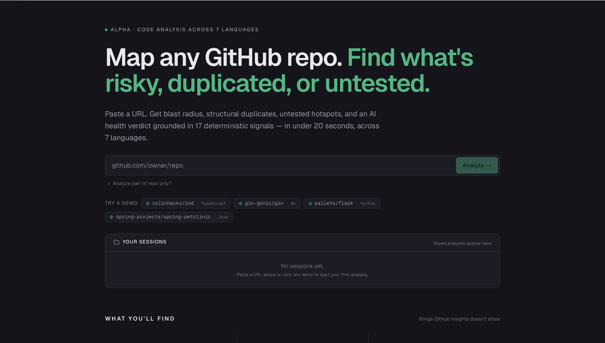
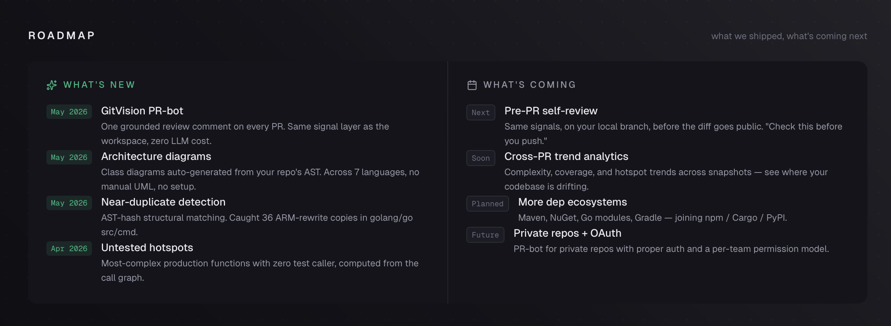
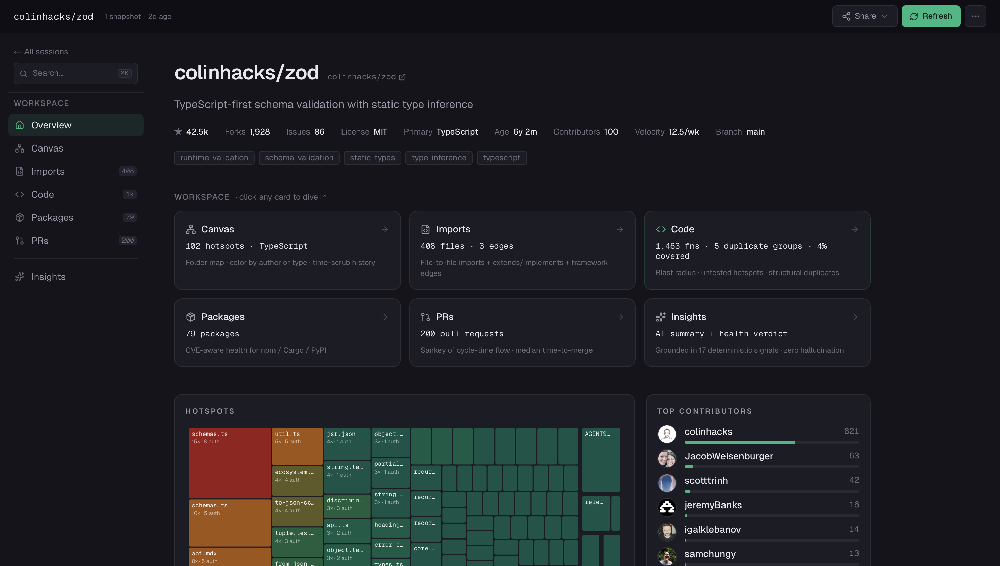
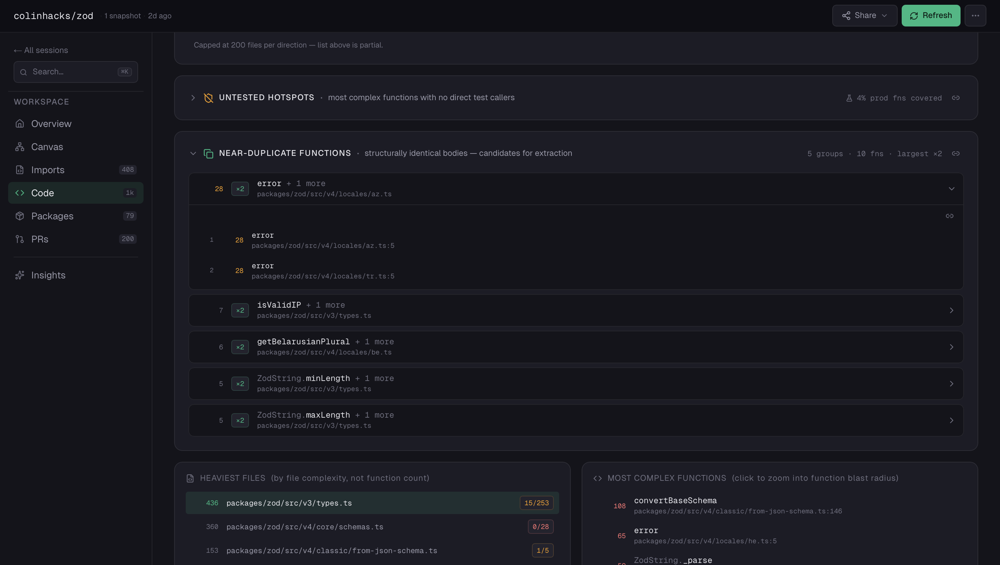
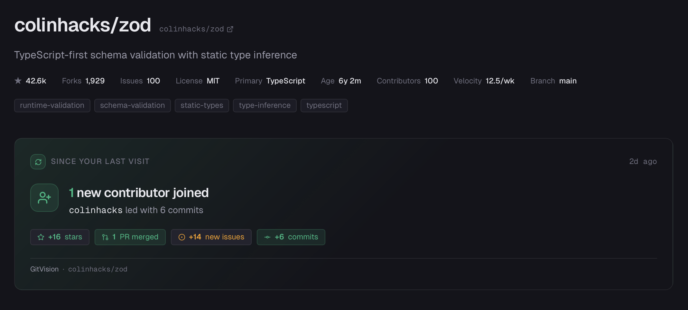
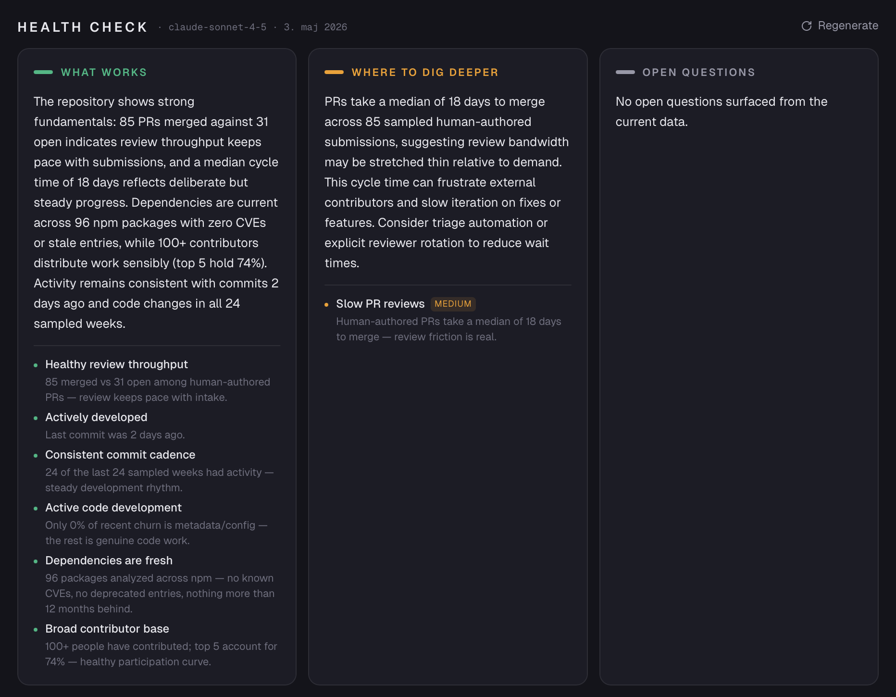

# RepoJury

> Know your code before you touch it.

A codebase intelligence layer for the AI-augmented era — workspace
dashboards plus a GitHub PR-bot, sharing one deterministic signal
pipeline across 7 languages. Paste a URL, get blast radius, untested
hotspots, structural duplicates, and architecture diagrams in under
20 seconds.




## Why RepoJury

GitHub Insights gives you commit counts and a contributor list. RepoJury
gives you the questions an engineering manager actually asks:

- **What breaks if I change this file?** — three-hop blast radius across
  the call graph, computed from tree-sitter AST parses.
- **Where's the tech debt nobody's looking at?** — structural duplicate
  detection that spotted 36 copies of one ARM rewrite pattern in
  `golang/go/src/cmd`.
- **What complex code is the test suite ignoring?** — per-function test
  coverage estimated by walking the call graph from test files into
  production code. No external coverage tool needed.
- **What changed since I last looked?** — a story-driven refresh banner,
  not a metadata diff.

Every AI claim is grounded in a deterministic signal computed
server-side. Zero hallucination room.

## Try it

👉 **[codetrawl.com](https://codetrawl.com)** — 4 pre-analyzed demo repos load instantly. No signup, no setup.

Or run it locally:

```bash
# 1. Install
git clone https://github.com/coffeejones/repobaron
cd repobaron
npm install

# 2. Recommended: GitHub token (60 → 5000 req/hr)
cp .env.example .env.local
# Edit .env.local — paste your token after GITHUB_TOKEN=
# Generate at https://github.com/settings/tokens/new — tick `public_repo` only.

# 3. Optional: Anthropic key for AI summaries + health verdict
# Edit .env.local — paste after ANTHROPIC_API_KEY=
# Skip this and the AI panels just hide gracefully.

# 4. Run
npm run dev
# → open http://localhost:3000
```

Node 20.9+ required (tested on 25.x).

## Two surfaces, one signal layer

RepoJury delivers the same analysis through two different surfaces:

**Workspace** — `codetrawl.com`. Paste a URL, get an explorable
dashboard with blast radius, untested hotspots, near-duplicates,
architecture diagrams, dependency health, and a red / yellow / green
verdict grounded in 17 deterministic signals. The destination for
deep-dive analysis and "understand this repo before I work on it"
workflows.

**PR-bot** — a native GitHub App. Install on a public repo and every
new PR gets one grounded review comment with the top verification
signals from the diff. Same pipeline as the workspace, packaged for
review-time. Zero LLM cost, deterministic-only, find-or-update so
repeated `synchronize` events don't stack duplicate comments.

Both surfaces share the same diff-aware AST analysis, the same
calibrated rules engine, the same plugin architecture. Improvements
to one improve the other.



## What you'll find

Each session opens as a workspace with a persistent sidebar — every
tab is its own URL, screenshot-worthy alone.



**Canvas** — Folder frames + file cards laid out as a packed map. Color
by file type or by dominant author. Time-scrub to see the codebase
evolve commit-by-commit.

**Imports** — File-to-file import graph as a brick-stagger layered
layout. Click a file to isolate its 1-hop neighborhood.

**Code** — The AST-based analysis hero. Three insight panels above
twin lists:

- **Blast radius** — file mode shows incoming + outgoing dependency
  hops. Click a function to zoom into function-level: callers and
  callees.
- **Untested hotspots** — most-complex production functions with no
  direct test caller. Per-file coverage badges scaled by ratio.
- **Near-duplicates** — structural AST-hash groups. Sorted by
  `groupSize × maxComplexity` so the worst tech-debt finds rise to
  the top.



**Architecture** — Auto-generated class diagrams from the AST.
First inhabitant of the Architecture tab — class hierarchies,
field types, method signatures rendered as boxes you can pan around.
Across all 7 AST-supported languages, no manual UML, no setup.

**Packages** — Multi-ecosystem dependency health (npm, Cargo, PyPI).
Vulnerable / outdated / deprecated packages with direct CVE links.

**PRs** — Sankey of cycle-time flow: Opened → Outcome → time-to-merge
bucket. Plus an inline PR-bot install callout for "want this analysis
on every new PR?".

Plus, on the Overview page:

- **Refresh banner** — "Since your last visit": story-driven headline
  ("1 new contributor joined — colinhacks led with 6 commits") + the
  metric chips behind it.

  

- **AI summary** — 150-200 word repo profile. Grounded in computed
  facts; no hallucinated claims.
- **AI health verdict** — three-column "What works / Where to dig
  deeper / Open questions". Each bullet maps to one of 17
  deterministic signals computed server-side.

  

**Cmd+K palette** — keyboard navigation across pages, files, and
functions. Linear / Raycast / Sublime pattern — type to filter, arrows
to navigate, Enter to jump.

## GitHub App (PR-bot)

The PR-bot half of the two surfaces above — installable on any public
repo, posts a single grounded review comment on every PR. Same signal
layer as the workspace, packaged for the PR-review workflow.

### What you get

A comment like this on every PR:

```markdown
## RepoJury Review

**Diff summary:** 3 files changed · functions: 5 added, 2 removed, 7 modified · net complexity +4

### Suggested verification (top 3)

1. 🔴 **CRITICAL** — load_dotenv in `src/flask/cli.py` grew by +4 cyclomatic complexity (9 → 13). No tests in the same module were changed.
2. 🟡 **WARNING** — _path_is_relative_to was removed from `src/flask/sansio/scaffold.py` (original complexity 2). Verify no callers still depend on it.
3. 🟢 **INFO** — Sizeable PR — touches 23 files with 109 function-level changes.

---
[Full analysis ↗](https://codetrawl.com/session/…) · _Signals computed deterministically — no LLM in this comment_
```

When nothing crosses the calibrated thresholds, you still get a short
positive comment (`Nothing notable on this PR ✅`) so reviewers know we
ran. No silent skips.

### How it works

1. You install the app on a public repo
2. On `pull_request.opened` / `synchronize` / `reopened` /
   `ready_for_review`, the app analyzes the base + head SHAs
3. `computeDiff` + the rules engine produce up to 3 prioritized
   verification suggestions
4. Comment posted via the installation token, find-or-update so
   re-runs on the same PR don't stack duplicates

Same pipeline as the workspace — diff-aware AST analysis across 7
languages via tree-sitter, computed server-side. **No LLM in the
comment**: every claim maps to a deterministic signal with citable
evidence.

### Install

🚧 **Currently in private beta.** v1.0 install ceremony will land at
`https://github.com/apps/codetrawl-pr` once we've
validated noise rate on 2-3 friendly real-world repos. If you want
to be one of those early installs, [open an issue](https://github.com/coffeejones/repobaron/issues).

### Limits & guardrails

| Guardrail | Cap | Why |
|---|---|---|
| Repo size | 100 MB | Mega-repos eat bandwidth + clone time + disk |
| PRs per installation per hour | 10 | Protects against flood (e.g. force-push of 50 branches) |
| Concurrent analyses per installation | 2 | Per-process memory ceiling on Railway |
| Public repos only | yes | Private-repo support deferred to v2 (with OAuth) |

### Privacy

- We **clone your repo** read-only to analyze it. Analysis runs on
  Railway, results are stored as JSON sessions
- Sessions created by the PR-bot are **public-by-default** — the
  "Full analysis" link is a public read-only URL. Don't install the
  app on a repo whose code shouldn't be analyzed publicly.
- **No LLM** sees the diff. The comment text is rendered from
  deterministic rules, not generated.
- When you **uninstall**, every session the bot created for that
  installation is deleted within seconds (`installation.deleted` →
  GC sweep). Workspace-created sessions for the same repo are NOT
  affected — they came from a different consent flow.

### Architecture

The whole PR-bot lives in the same Next.js app as the workspace.
Webhook handler at `app/api/github/webhook/route.ts`, business logic
in `lib/githubApp/`. Heavy work runs via Next's `after()` so the
webhook response ships in <100ms regardless of analysis duration.

Design + decisions: [eval/strategy/github-app-skeleton-2026-05.md](./eval/strategy/github-app-skeleton-2026-05.md).
End-to-end validation: [eval/strategy/github-app-validation-2026-05.md](./eval/strategy/github-app-validation-2026-05.md).

## Language coverage

| Language     | Plugin           | Imports | Functions | Calls | Complexity | Type-aware |
| ------------ | ---------------- | ------- | --------- | ----- | ---------- | ---------- |
| JS / TS      | `javascript`     | ✅ AST  | ✅        | ✅    | ✅         | ✅         |
| Python       | `python`         | ✅ AST  | ✅        | ✅    | ✅         | ✅         |
| Go           | `go`             | ✅ AST  | ✅        | ✅    | ✅         | ✅         |
| Java         | `java`           | ✅ AST  | ✅        | ✅    | ✅         | ✅         |
| C#           | `csharp`         | ✅ AST  | ✅        | ✅    | ✅         | ✅         |
| PHP          | `php`            | ✅ AST  | ✅        | ✅    | ✅         | ✅         |
| Ruby         | `ruby`           | ✅ AST  | ✅        | ✅    | ✅         | partial    |
| Kotlin       | `regex-fallback` | ✅      | —         | —     | —          | —          |
| HTML / CSS   | `regex-fallback` | render-target only — Spring MVC controllers, etc.    |

Kotlin migration is blocked upstream
([`tree-sitter-wasms@0.1.13` ABI mismatch with `web-tree-sitter@0.26.8`](https://github.com/tree-sitter/tree-sitter/discussions/2912)).
Until a compatible WASM grammar appears, Kotlin gets imports only.

## Architecture (light)

```
app/                        Next.js App Router
├─ page.tsx                 Landing (adaptive: marketing or workspace)
├─ session/[id]/page.tsx    Session dashboard
└─ api/
   ├─ sessions/             POST /sessions, /refresh, /summary, /health
   └─ github/webhook/       PR-bot webhook receiver

components/                 React Flow canvases + panels + UI primitives
lib/
├─ codeAnalysis/            AST pipeline — plugins/ per language + WASM runtime
├─ depsHealth/              Multi-ecosystem dep-health — ecosystems/ per registry
├─ githubApp/               PR-bot pipeline (webhook, auth, events, poster)
├─ signals.ts               17 deterministic health detectors (no AI)
├─ healthAnalysis.ts        Constrained Claude narrative grounded in signals
├─ aiSummary.ts             Claude repo profile generator
├─ rateLimit.ts             Per-IP / per-installation rate limiter
├─ aiBudget.ts              Daily Anthropic call kill-switch
└─ storage.ts               File-based sessions (.gitvision/sessions/*.json)
```

Full architecture, design decisions, and a per-version changelog live
in [PROGRESS.md](./PROGRESS.md) — required reading if you're
contributing or branching ideas off the codebase.

## Tech stack

- **Next.js 16** App Router (Turbopack dev, webpack prod)
- **React 19** + TypeScript 5 (strict)
- **Tailwind CSS v4** via `@tailwindcss/postcss`
- **@xyflow/react** (React Flow 12) for both canvases
- **web-tree-sitter** + `@vscode/tree-sitter-wasm` for AST parsing
- **D3 v7** for treemap + sankey + color scales
- **Octokit** for GitHub REST API
- **`@iarna/toml`** for Cargo + PyPI manifest parsing
- **`@anthropic-ai/sdk`** Claude Sonnet 4.5 (optional)
- **vitest** — 1000+ unit tests across plugins, signals, parsers,
  the rate-limit / AI-budget rails, and the GitHub App pipeline

Storage is filesystem-based (`.gitvision/sessions/<id>.json`). No
database. Inspectable, portable, gitignored.

## Cross-platform

Runs identically on macOS, Linux (Railway), and Windows. Cross-platform
npm scripts; `.gitattributes` pins LF line endings.

## Contributing

Project status is **alpha**. Bug reports and feature ideas are welcome
via [GitHub Issues](https://github.com/coffeejones/repobaron/issues). Note
the license — see below.

## License

RepoJury is licensed under the **PolyForm Noncommercial License 1.0.0**
— see [LICENSE](./LICENSE).

- **Yes** to personal use, learning, experimentation, hobby projects,
  academic research, teaching, nonprofit organizations.
- **No** to using this code (or derivatives) in a commercial product
  or for-profit service without a separate commercial license.

If you want to use RepoJury commercially, [open an issue](https://github.com/coffeejones/repobaron/issues)
or get in touch.

Copyright © 2026 Jonas Hansen.
