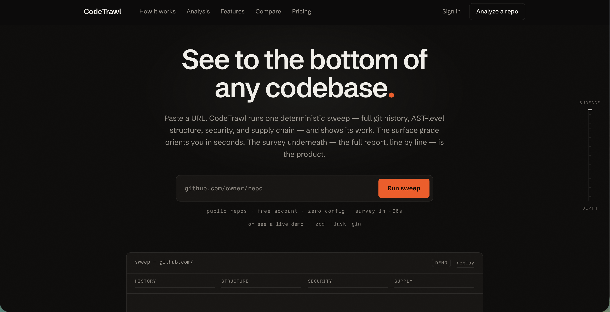
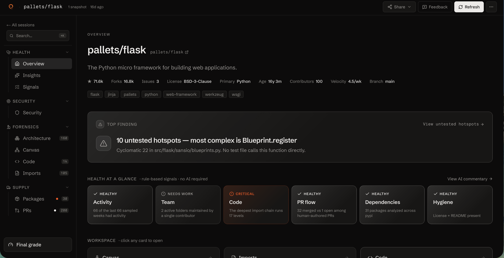
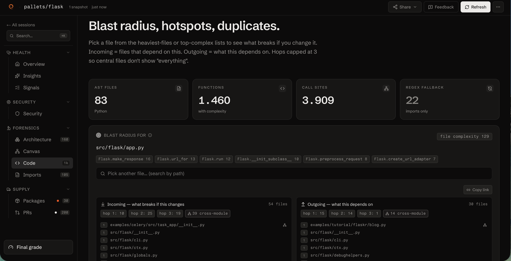
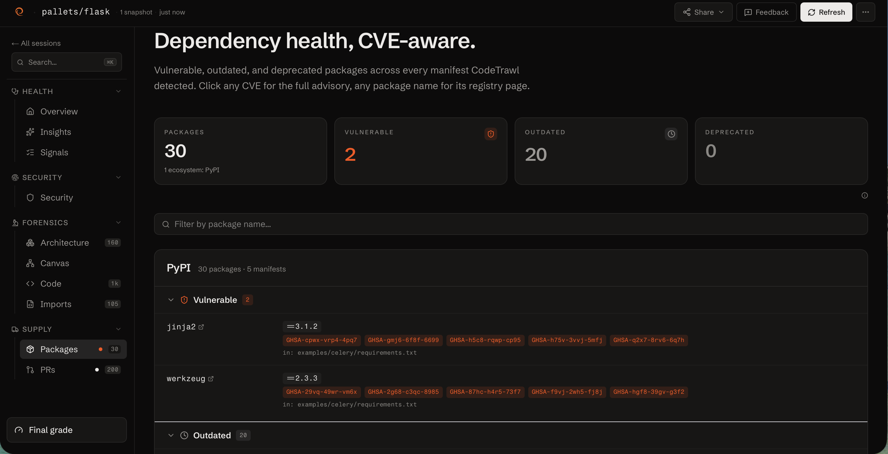
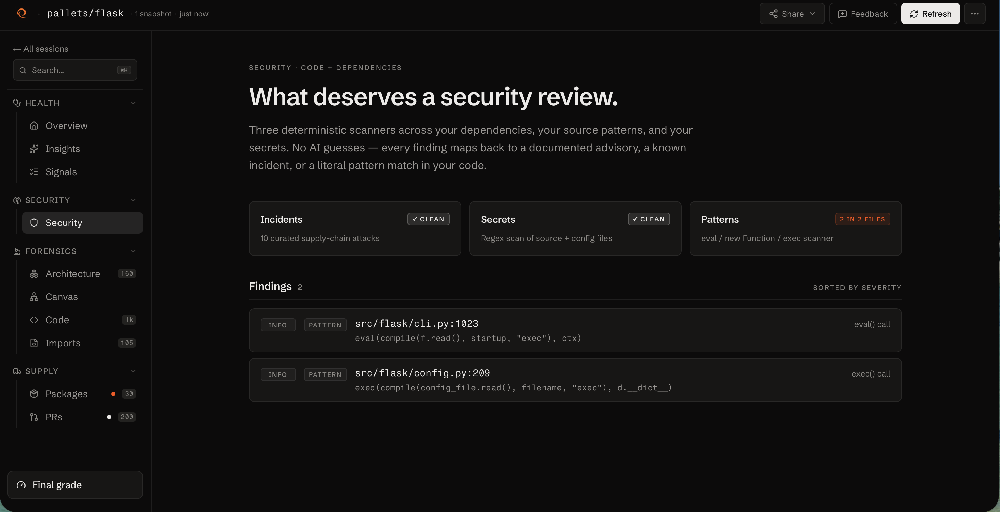
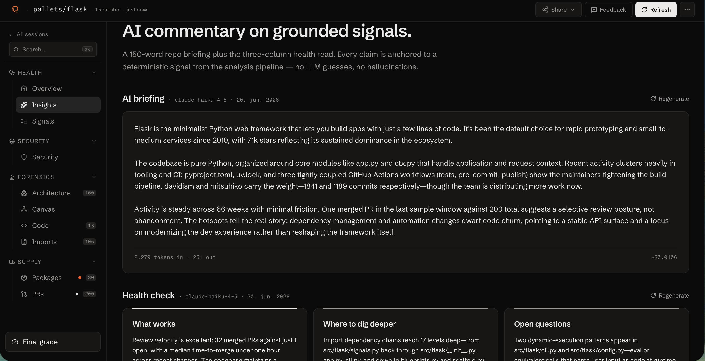
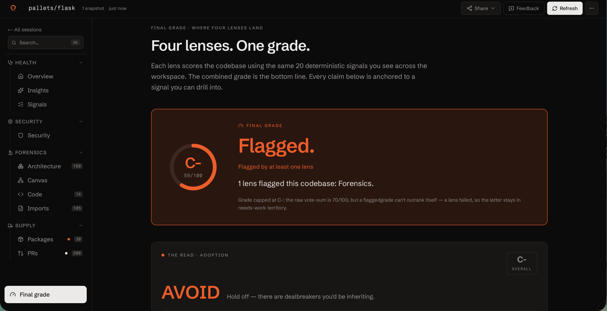

# CodeTrawl

> See to the bottom of any codebase — and know what a change breaks before you make it.

CodeTrawl is a **deterministic verification layer for code in the AI era.** Paste
a public GitHub repo and get blast radius, untested hotspots, structural
duplicates, a dependency-health panel, and architecture diagrams in under 20
seconds — then *simulate* a change and get a cited, sub-second verdict on what it
would break. The same engine backs a human workspace, a GitHub PR gate with a
signed merge receipt, and an MCP server that gives AI agents a conscience.

Every claim is grounded in a signal computed server-side from the real import +
call graph. **No LLM in any verdict — zero hallucination room.**




## Why CodeTrawl

GitHub Insights gives you commit counts and a contributor list. CodeTrawl answers
the questions an engineer — or an AI agent — actually needs before touching code:

- **What breaks if I change this file?** — three-hop blast radius across the call
  graph, from real tree-sitter AST parses.
- **What breaks if I *delete* this?** — the **Faultline Simulator** rebuilds the
  graph live from your change and shows the casualties, the untested ones flagged.
- **Where's the tech debt nobody's looking at?** — structural duplicate detection
  that spotted 36 copies of one ARM rewrite pattern in `golang/go/src/cmd`.
- **What complex code is the test suite ignoring?** — per-function coverage from
  walking the call graph, no external coverage tool needed.
- **Does this PR ship a regression nothing catches?** — a deterministic **Gate**
  on every pull request, with a signed, verifiable **merge receipt**.

## Try it

👉 **[codetrawl.com](https://codetrawl.com)** — pre-analyzed demo repos load
instantly. No signup, no setup.

Or run it locally:

```bash
# 1. Install
git clone https://github.com/coffeejones/gitvision
cd gitvision
npm install

# 2. Recommended: GitHub token (60 → 5000 req/hr)
cp .env.example .env.local
# Edit .env.local — paste your token after GITHUB_TOKEN=
# Generate at https://github.com/settings/tokens/new — tick `public_repo` only.

# 3. Optional: Anthropic key for AI summaries + health verdict
# Edit .env.local — paste after ANTHROPIC_API_KEY=
# Skip this and the AI panels just hide gracefully.

# 4. Run
npm run dev
# → open http://localhost:3000
```

Node 20.9+ required (tested on 25.x).

## Four surfaces, one signal layer

The same deterministic analysis, delivered four ways:

**Workspace** — `codetrawl.com`. Paste a URL, get an explorable dashboard: blast
radius, untested hotspots, near-duplicates, architecture diagrams, dependency
health, a security/evidence desk, and a red / yellow / green verdict grounded in
deterministic signals.

**Faultline Simulator** — pick a file, simulate a change, and watch what it
breaks — a live blast shockwave rebuilt from the cached code graph in under a
second. Deterministic, cited to real edges.

**The Gate** — a native GitHub App. Install on a public repo and every PR gets a
**Check Run** driven by the blast verdict (clear / review / high-risk) plus a
grounded comment and a **signed merge receipt** — a verifiable record that the
gate ran on that exact commit.

**For agents (MCP)** — an MCP server that hands an AI coding agent the blast
radius and a `simulate_change` conscience: propose a diff, get a stop/go gate
*before* committing.

Every surface shares the same diff-aware AST analysis, the same calibrated rules
engine, the same plugin architecture. Improvements to one improve them all.

## What you'll find

Each session opens as a workspace with a persistent sidebar — every tab is its
own URL, screenshot-worthy alone.



**Canvas** — folder frames + file cards as a packed map. Color by file type or
dominant author; time-scrub to watch the codebase evolve commit-by-commit.

**Imports** — the file-to-file import graph as a layered brick-stagger layout.
Click a file to isolate its neighborhood.

**Code** — the AST analysis hero. Blast radius (file + function level), untested
hotspots (most-complex production functions with no direct test caller), and
near-duplicates (structural AST-hash groups, worst tech-debt first).



**Faultline** — the change simulator. Pick a file, see the deterministic blast +
the required-actions "conscience" + the affected-file shockwave.

**Refactor** — "Can I touch this?" Every file ranked by how safely you can change
it: blast reach, untested dependents, complexity, duplication. Named tiers, with
the evidence on every row.

**Architecture** — auto-generated class diagrams from the AST across all
AST-supported languages. No manual UML, no setup.

**Packages** — multi-ecosystem dependency health (npm, Cargo, PyPI). Vulnerable /
outdated / deprecated packages with direct CVE links.



**Security / Evidence** — secret + risky-pattern scans, CI-hardening checks, an
SBOM export (CycloneDX / SPDX), and a one-zip evidence pack.



**PRs** — a Sankey of cycle-time flow, plus a Merge Confidence read for
PR-analysis sessions.

Plus, on the Overview and Insights pages:

- **Refresh banner** — "Since your last visit": a story-driven headline + the
  metric chips behind it.
- **AI briefing** — a grounded repo profile + a three-column health verdict
  ("What works / Where to dig deeper / Open questions"), each bullet mapped to a
  deterministic signal.



- **Final grade** — the whole analysis distilled to one honest, computed verdict.



**Cmd+K palette** — keyboard navigation across pages, files, and functions.

## The Gate (GitHub App)

Install the app on a public repo and every PR is analyzed at the base + head SHA.
Same signal layer as the workspace, packaged for review-time.

- **A Check Run** on the merge box, from the deterministic blast verdict: clear →
  success, review → neutral, high-risk → failure. A red conclusion doesn't block
  on its own — the repo decides via branch protection.
- **A grounded comment** leading with the verdict + the top verification signals
  from the diff. No LLM in the comment; every claim cites a deterministic signal.
- **A signed merge receipt** — an HMAC-SHA256 certificate that the gate ran on
  that exact commit, permalinked and independently verifiable at
  `/api/receipts/verify`.
- **Find-or-update** so re-runs on `synchronize` don't stack duplicate comments;
  a fresh check per commit.

Guardrails: public repos only, ≤100 MB, per-installation rate + concurrency caps.
On uninstall, every session and receipt the bot created is deleted within seconds.

Webhook handler at `app/api/github/webhook/route.ts`; business logic in
`lib/githubApp/`. Heavy work runs via Next's `after()` so the webhook responds in
<100 ms regardless of analysis duration.

## For agents — the Conscience over MCP

CodeTrawl exposes the code graph as an **MCP server** so Claude Code, Cursor, or
anything that speaks MCP can ask *"what breaks if I change this?"* — and verify a
change **before** it commits. Verdicts, not raw graph dumps.

Nine tools, headlined by:

- **`analyze_repo`** — parse a repo → a session id (always first).
- **`blast_radius`** — what breaks if you change a file or function.
- **`simulate_change`** — simulate a proposed diff → a deterministic blast + a
  pass/block **conscience gate**. The pre-commit check.

…plus `untested_hotspots`, `find_duplicates`, `signals`, `compare_sessions`,
`analyze_diff`, and `review_changes`.

And a first-class **`conscience` prompt** that codifies the loop: propose →
`simulate_change` → resolve the blocking gate (untested regressions, hollow
tests) or justify it → re-simulate until `gate.pass`. See
[codetrawl.com/agents](https://codetrawl.com/agents).

## Language coverage

| Language     | Plugin           | Imports | Functions | Calls | Complexity | Type-aware |
| ------------ | ---------------- | ------- | --------- | ----- | ---------- | ---------- |
| JS / TS      | `javascript`     | ✅ AST  | ✅        | ✅    | ✅         | ✅         |
| Python       | `python`         | ✅ AST  | ✅        | ✅    | ✅         | ✅         |
| Go           | `go`             | ✅ AST  | ✅        | ✅    | ✅         | ✅         |
| Java         | `java`           | ✅ AST  | ✅        | ✅    | ✅         | ✅         |
| C#           | `csharp`         | ✅ AST  | ✅        | ✅    | ✅         | ✅         |
| PHP          | `php`            | ✅ AST  | ✅        | ✅    | ✅         | ✅         |
| Ruby         | `ruby`           | ✅ AST  | ✅        | ✅    | ✅         | partial    |
| Kotlin       | `regex-fallback` | ✅      | —         | —     | —          | —          |

The Shadow-Graph fast path (Faultline + `simulate_change`) is golden-equivalent
for JS/TS; other languages get declared approximations. Kotlin gets imports only
until a compatible WASM grammar ships.

## Architecture (light)

```
app/                        Next.js App Router
├─ page.tsx                 Landing (adaptive: marketing or workspace)
├─ session/[id]/            Workspace tabs (Overview, Code, Faultline, …)
├─ r/[id]/                  Public signed merge-receipt certificate
└─ api/
   ├─ sessions/[id]/simulate  The change-simulation endpoint
   ├─ receipts/verify         Trustless receipt verification
   └─ github/webhook/         The Gate — PR webhook receiver

components/                 React Flow canvases + panels + UI primitives
lib/
├─ codeAnalysis/            AST pipeline — plugins/ per language + WASM runtime
├─ shadowGraph/             Sub-second incremental patcher + simulate + gate
├─ changeBlast/             Base-vs-head blast report engine
├─ depsHealth/              Multi-ecosystem dep-health — ecosystems/ per registry
├─ githubApp/               The Gate — webhook, pipeline, check run, comment
├─ receipt.ts              HMAC-signed merge receipts
├─ signals.ts               Deterministic health detectors (no AI)
└─ storage.ts               File-based sessions (.gitvision/sessions/*.json)

mcp/                        MCP server — tools + the conscience prompt
```

Full design decisions and a per-version history live in
[PROGRESS.md](./PROGRESS.md) and [CHANGELOG.md](./CHANGELOG.md).

## Tech stack

- **Next.js 16** App Router (Turbopack dev, webpack prod)
- **React 19** + TypeScript 5 (strict)
- **Tailwind CSS v4** via `@tailwindcss/postcss`
- **@xyflow/react** (React Flow 12) for the canvases
- **web-tree-sitter** + `@vscode/tree-sitter-wasm` for AST parsing
- **D3 v7** for treemap + sankey + color scales
- **Octokit** for the GitHub REST + App APIs
- **`@modelcontextprotocol/sdk`** for the MCP server
- **Anthropic Claude** (optional) for the grounded briefing + health narrative
- **vitest** — 1700+ unit tests across plugins, signals, the Shadow-Graph patcher,
  the receipt crypto, the rate-limit / AI-budget rails, and the GitHub App

Storage is filesystem-based (`.gitvision/sessions/<id>.json`). No database.
Inspectable, portable, gitignored.

## Cross-platform

Runs identically on macOS, Linux (Railway), and Windows. Cross-platform npm
scripts; `.gitattributes` pins LF line endings.

## Contributing

Bug reports and feature ideas are welcome via
[GitHub Issues](https://github.com/coffeejones/gitvision/issues). Note the license
— see below.

## License

CodeTrawl is licensed under the **PolyForm Noncommercial License 1.0.0** — see
[LICENSE](./LICENSE).

- **Yes** to personal use, learning, experimentation, hobby projects, academic
  research, teaching, nonprofit organizations.
- **No** to using this code (or derivatives) in a commercial product or for-profit
  service without a separate commercial license.

If you want to use CodeTrawl commercially,
[open an issue](https://github.com/coffeejones/gitvision/issues) or get in touch.

Copyright © 2026 Jonas Hansen.
